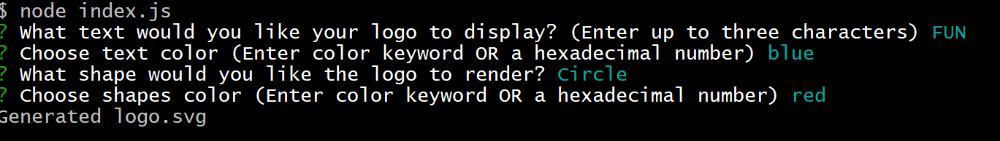
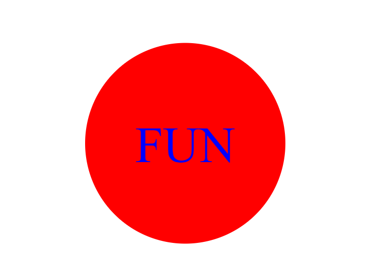

# Loghi-Creati-Dinamicamente
## Demo Video
https://drive.google.com/file/d/1EOY7dYX3hyOHZYEUOzaTBEXaiM4ZH0VN/view
## Test Case with Data Entry and Picture

## Description

Loghi-Creati-Dinamicamente is a command-line application that allows users to design custom logos by specifying text, text color, shape, and shape background color. It creates scalable vector graphics (SVG) files representing the logos based on user input.

## Technologies Used

- Node.js
- Inquirer.js (for user interaction)

## Features

- **User Input**: Users can provide the following input to design their logo:
  - Text to display in the logo (up to three characters).
  - Text color, which can be entered as a color keyword (e.g., "red") or a hexadecimal color code (e.g., "#FF0000").
  - Choice of shape: Triangle, Square, or Circle.
  - Shape background color, entered in the same way as text color.

- **Input Validation**: The program validates user input to ensure it meets certain criteria:
  - Text input should not exceed three characters.
  - Text color and shape background color should be valid color keywords or hexadecimal color codes.

- **Logo Creation**: If the user's input passes validation, the program creates a logo with the specified text, text color, shape, and shape background color.

- **Output**: The program generates an SVG file named "logo.svg," containing the visual representation of the logo.

## Usage

1. Clone this repository to your local machine.

2. Install Node.js if you haven't already: [Node.js Official Website](https://nodejs.org/)

3. Open your terminal or command prompt.

4. Navigate to the directory where you cloned the repository.

5. Run the program using the following command: node index.js

